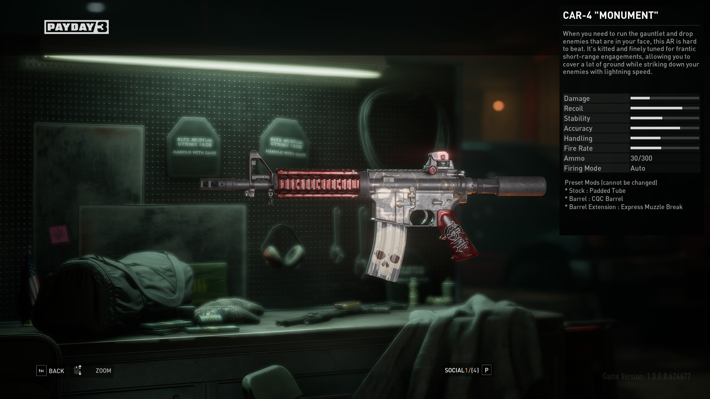

# The Failure of Payday 3 UI

Earlier this month, the long-awaited sequel of the Payday franchise, Payday 3, came out. The game's launch was utterly abysmal, suffering from a terrible early-access stage that was not even available to PlayStation 5 users who paid for it and servers that shut down for 2 consecutive days. When the game was finally playable, players were greeted by a horrid and confusing UI. Now for the more simple actions the UI does suffice but I want to focus on 3 main issues that are experience-defining. 
  - In-game Lobby/Matchmaking
  - The Weapon Stat System

## In-game Lobby/Matchmaking

The game only offers online matchmaking for players who are in the game. This means that the whole game is server-dependent, so if the servers go down the game goes down. The user base has been asking for an offline solo mode for years as it was previously available in Payday 2. The developers' failure to provide this fundamental feature has resulted in the majority of their problems retaining players and their failing servers. Even if you are lucky enough to get in the lobby, many features and problems arise once you are in there. Server instability causes the lobby to lag and the loadout function barely works. Although it shows that you can change loadouts by hitting the arrows on the loadout tab, 50% of the time your loadout does not even switch when you get into the mission. Another point of aggravation is there is no ability to talk to your teammates and coordinate a plan to complete missions. In the previous installments, the ability to communicate with your team has been fundamental and available since the very first version of Payday The Heist (Payday 1). To top it all off, the cluttered and laggy UI has no ability to un-ready once you hit the ready button. If you accidentally ready or decide you want to make a last-minute change, the game forces you to quit back to the main menu, it won't even send you back to the mission select screen. All these steps to get into the game and missing features have turned players away from engaging with this product, and it gets worse.

## The Weapon Stat System

The weapon stat system is vague and confusing to put it simply. First off, weapons have levels. One would assume to increase a weapon level you would use the weapon. This is not the case. In fact, you can go a whole mission without even firing the weapon and still get a predestined amount of meaningless experience. The game encourages players to run through a heist as fast as possible and do the bare minimum and you will get whatever the game decides to give you. Even when you level a weapon, the attachments you get barely affect the weapon stats. Stats are represented by vague lines on the right side of the screen. One would assume that if a weapon has a full bar in the recoil section for example, the weapon would have a lot of recoil. Again, the user is wrong, more full bar = less. See, this isn't the case for other stat bars. Each stat bar means different things based on its fullness. Attachments give vague changes represented by + and -. You would think + means more and - means less but again you are wrong. + can sometimes mean more but also less and the same goes for -. In Payday 2, each stat had a numerical value, the higher the number the better the stat. 

The shortcomings of the launch of Payday 3 have permanently destroyed a beloved franchise. Hours of video essays and documentaries have been made outlining even more issues than these. As a longtime fan of the franchise, I am heartbroken that the game has utterly failed in every way to satisfy the users' needs and that their response is to tell the user that they are wrong, but perhaps that is a journal entry for another time.
