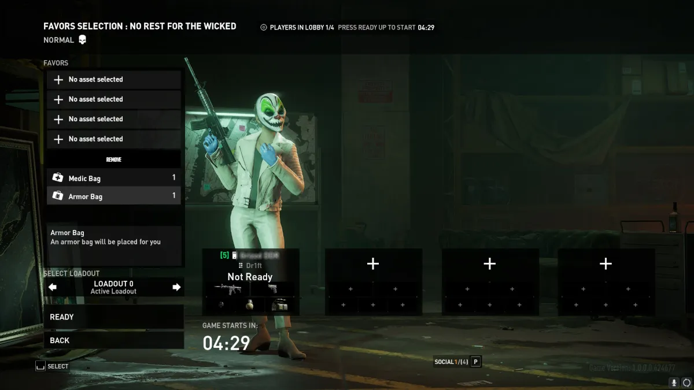

# The Failure of Payday 3 UI

Earlier this month, the long-awaited sequel of the Payday franchise, Payday 3, came out. The game's launch was utterly abysmal, suffering from a terrible early-access stage that was not even available to PlayStation 5 users who paid for it and servers that shut down for 3 consecutive days. When the game was finally playable, players were greeted by a horrid and confusing UI. Now for the more simple actions the UI does suffice but I want to focus on 3 main issues that are experience-defining. 
  - In-game Lobby/Matchmaking
  - The Weapon Stat System
  - The Mission Selection

## In-game Lobby/Matchmaking

